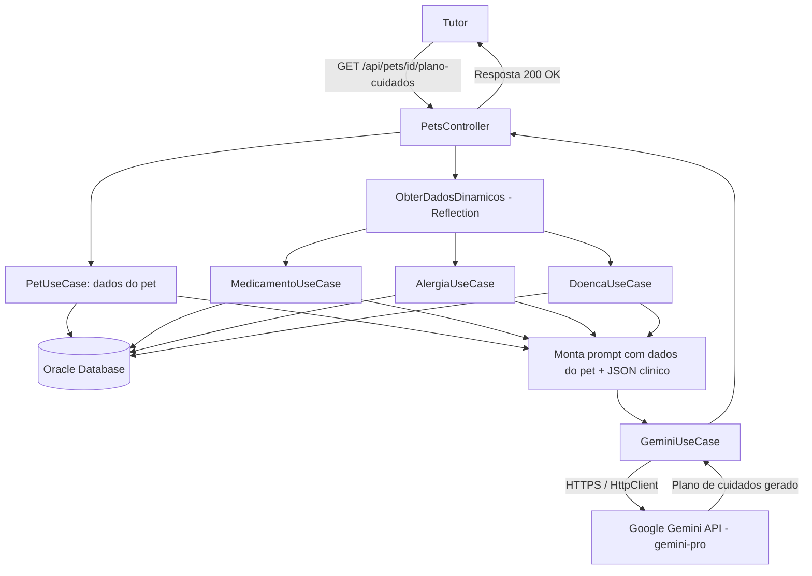

# CLYVO VET — Componente de Inteligência Artificial

## Disciplina: Disruptive Architectures: IoT, IoB & Generative IA
## Entrega — 3º Sprint

Este documento descreve o componente de Inteligência Artificial integrado à solução **CLYVO VET**, desenvolvido sobre a **Amandaba API**, atendendo aos objetivos da 3ª Sprint da disciplina.

---

## 🎥 Vídeo Pitch

Link do vídeo: **[https://youtu.be/UiwPPRTgK_0]**

---

## 1. Problema de Negócio

Dentro da jornada contínua de cuidado do pet, tutores frequentemente:

- esquecem ou não compreendem completamente as orientações passadas após uma consulta;
- têm dúvidas sobre como administrar corretamente os medicamentos prescritos;
- não sabem relacionar o quadro clínico do pet (doenças e alergias já registradas) com novas prescrições ou recomendações.

Isso gera **dúvidas recorrentes**, contatos desnecessários com a clínica e, em alguns casos, risco à saúde do animal por má interpretação das orientações. Do lado da clínica, esse volume de dúvidas repetitivas **sobrecarrega a equipe** e reduz o tempo disponível para casos que realmente exigem atenção especializada.

## 2. Solução Proposta

Foi implementado um **Gerador de Plano de Cuidados Personalizado**, um componente de IA integrado à Amandaba API que, sob demanda do tutor, gera um plano de cuidados textual e personalizado para o pet, cruzando o histórico clínico real armazenado no banco de dados.

### Valor para o tutor
- Recebe orientações claras, organizadas e personalizadas para o seu pet específico, sem precisar interpretar sozinho anotações de consulta ou bulas de medicamentos.
- Reduz a ansiedade e a insegurança na hora de cuidar do animal em casa.

### Valor para a clínica
- Reduz o volume de dúvidas repetitivas encaminhadas à equipe.
- Reforça a percepção de cuidado contínuo e de valor agregado do serviço, para além da consulta presencial.

### Valor para o pet
- Maior aderência do tutor ao tratamento correto (medicação, cuidados com alergias, acompanhamento de doenças), o que se traduz em melhores desfechos de saúde.

## 3. Abordagem de IA Escolhida

**Abordagem:** IA Generativa (LLM).

**Modelo utilizado:** Google Gemini (`gemini-pro`), consumido via API gratuita do Google AI Studio.

### Justificativa técnica

| Abordagem considerada | Motivo de não adoção como principal |
|---|---|
| Motor de regras inteligentes | Pouco flexível para lidar com a variabilidade de combinações entre espécies, doenças, alergias e medicamentos; exigiria manutenção manual constante das regras. |
| Sistema de recomendação clássico | Adequado para sugerir produtos/serviços, mas não para gerar explicações e orientações textuais personalizadas e contextualizadas. |
| NLP tradicional (classificação/extração) | Útil para estruturar dados, mas insuficiente para **gerar** um plano de cuidados coerente e legível para o tutor. |
| **IA Generativa (LLM) — escolhida** | Permite combinar dados estruturados heterogêneos (medicamentos, alergias, doenças, espécie do pet) em um texto coerente, contextualizado e em linguagem natural, funcionando como um "assistente" que interpreta e cruza as informações antes de apresentá-las ao tutor. |

Entre os modelos do Gemini avaliados, optou-se pelo `gemini-pro` em vez do `gemini-2.5-flash` por apresentar, nos testes realizados durante o desenvolvimento, **maior estabilidade de fila na camada gratuita**, reduzindo falhas de disponibilidade (`503`) durante as chamadas.

## 4. Dados Utilizados pela Solução

Todos os dados utilizados pela IA já são coletados e persistidos pela Amandaba API no banco Oracle, através das entidades existentes:

| Dado | Origem | Estrutura | Utilização pela IA |
|---|---|---|---|
| Perfil do pet (nome, espécie) | Entidade `Pet` / `Especie` (Oracle, via `PetUseCase.ObterPorId`) | Registro relacional | Contextualiza o prompt (ex.: "Amora, porquinha da índia") |
| Medicamentos em uso | Entidade `Medicamento`, filtrada por status `EM_USO` | Lista relacional (JSON serializado) | Permite à IA cruzar medicação atual com alergias registradas |
| Alergias | Entidade `Alergia` | Lista relacional (JSON serializado) | Base para checagem de segurança na recomendação |
| Doenças / condições de saúde | Entidade `Doenca` | Lista relacional (JSON serializado) | Contextualiza cuidados específicos da condição do pet |
| (Extensível) Histórico de peso, vacinas, consultas e exames | Entidades já existentes na API | Registros relacionais | Podem ser incorporados a versões futuras do prompt para enriquecer ainda mais o plano gerado |

### Como os dados chegam até a IA

1. Os dados são obtidos dos respectivos `UseCases` da aplicação (padrão já usado pela API), via um método auxiliar (`ObterDadosDinamicos`) que utiliza *Reflection* para não acoplar o `PetsController` a todos os `UseCases` de forma rígida.
2. Os objetos retornados (entidades do Entity Framework) são serializados em JSON.
3. O JSON é injetado dinamicamente dentro do prompt enviado ao Gemini, junto a um *system prompt* que instrui o modelo a atuar como um sistema de apoio veterinário.

## 5. Estratégia de Personalização, Priorização e Apoio à Decisão

- **Personalização:** o plano de cuidados é gerado a partir dos dados reais e atuais daquele pet específico (nome, espécie, medicamentos, alergias, doenças) — não é um texto genérico.
- **Priorização de ações:** o *system prompt* instrui o modelo a destacar primeiro os pontos de atenção mais relevantes (ex.: possíveis interações entre medicamento em uso e alergia registrada) antes de orientações gerais.
- **Apoio à tomada de decisão:** ao cruzar ativamente medicamentos e alergias, a IA atua como uma camada adicional de checagem, sinalizando ao tutor pontos que merecem contato com a clínica, sem substituir o julgamento do veterinário.

## 6. Arquitetura de Integração

### Fluxo de dados entre usuário, aplicação, banco de dados e IA

```text
┌────────────┐        HTTP GET /api/pets/{petId}/plano-cuidados
│   Tutor    │ ───────────────────────────────────────────────┐
│ (Frontend/ │                                                 │
│  Swagger)  │                                                 ▼
└────────────┘                                     ┌───────────────────────┐
                                                    │   PetsController      │
                                                    │  (Presentation)       │
                                                    └──────────┬────────────┘
                                                               │
                                    ┌──────────────────────────┼───────────────────────────┐
                                    ▼                                                       ▼
                        ┌───────────────────────┐                            ┌───────────────────────────┐
                        │      PetUseCase        │                           │   ObterDadosDinamicos      │
                        │ (dados cadastrais do   │                           │ (Reflection sobre UseCases │
                        │  pet: nome, espécie)   │                           │  de Medicamento, Alergia   │
                        └──────────┬─────────────┘                          │  e Doença)                 │
                                   │                                        └──────────┬─────────────────┘
                                   ▼                                                   ▼
                        ┌───────────────────────────────────────────────────────────────────┐
                        │                     Repository / Entity Framework Core             │
                        └──────────────────────────────┬──────────────────────────────────────┘
                                                         ▼
                                               ┌───────────────────┐
                                               │   Oracle Database  │
                                               └─────────┬───────────┘
                                                         │ dados clínicos
                                                         ▼
                                             ┌─────────────────────────────┐
                                             │   Dados serializados (JSON) │
                                             │   + System Prompt           │
                                             └──────────────┬──────────────┘
                                                             ▼
                                                 ┌───────────────────────┐
                                                 │     GeminiUseCase      │
                                                 │ (Application layer)    │
                                                 └───────────┬─────────────┘
                                                              │ HttpClient (HTTPS)
                                                              ▼
                                                 ┌───────────────────────┐
                                                 │  Google Gemini API     │
                                                 │  (gemini-pro)          │
                                                 └───────────┬─────────────┘
                                                              │ resposta gerada (texto)
                                                              ▼
                                                 ┌───────────────────────┐
                                                 │   PetsController       │
                                                 │  (retorna ao tutor)    │
                                                 └───────────┬─────────────┘
                                                              ▼
                                                        ┌────────────┐
                                                        │   Tutor    │
                                                        │ (recebe o  │
                                                        │  plano de  │
                                                        │  cuidados) │
                                                        └────────────┘
```

### Diagrama (Mermaid)



### Componentes da arquitetura

| Componente | Responsabilidade |
|---|---|
| **PetsController** (Presentation) | Expõe o endpoint `GET /api/pets/{petId}/plano-cuidados`, documentado via Swagger |
| **PetUseCase** | Fornece os dados cadastrais reais do pet (nome, espécie) |
| **ObterDadosDinamicos** (método auxiliar, Reflection) | Busca dinamicamente o histórico de medicamentos, alergias e doenças, sem acoplar o controller a todos os UseCases |
| **Entity Framework Core / Repositories** | Acesso aos dados persistidos no Oracle |
| **Oracle Database** | Armazena os dados clínicos utilizados como entrada para a IA |
| **GeminiUseCase** (Application) | Encapsula a comunicação HTTP com a API do Google Gemini, monta o prompt e trata erros de resposta |
| **Google Gemini API** | Modelo de linguagem responsável por gerar o plano de cuidados personalizado |
| **appsettings.json → seção "Gemini"** | Armazena a `ApiKey` e a `Url` do endpoint, fora do código-fonte versionado |

## 7. Observabilidade da Integração com IA

A chamada à API do Google Gemini é monitorada com os mesmos mecanismos já existentes na Amandaba API:

- **Serilog:** registra logs estruturados (`Information`, `Warning`, `Error`) da chamada, incluindo `TraceId` e `SpanId`.
- **OpenTelemetry:** instrumenta a chamada HTTP feita via `HttpClient` até a API do Google, permitindo acompanhar duração da requisição e status da resposta.
- **Tratamento de erros do GeminiUseCase:** em caso de falha (ex.: `404 Not Found`, `503 Service Unavailable`), o corpo da resposta do Google é lido e repassado, facilitando o diagnóstico.

## 8. Validação Realizada

- Fluxo completo testado via Swagger em ambiente local: `Controller → UseCase → GeminiUseCase → API Google → Controller`.
- Teste com um pet real cadastrado na base (ex.: porquinha da índia "Amora"), confirmando que os dados usados no prompt (espécie, medicamentos, alergias, doenças) refletem o cadastro real, e não valores fixos no código.
- Logs de tracing confirmados, validando a correlação entre a requisição do tutor e a chamada externa à IA.

## 9. Resultados Parciais (3º Sprint)

- Endpoint de plano de cuidados implementado e funcional (`GET /api/pets/{petId}/plano-cuidados`).
- Integração ponta a ponta com a API do Google Gemini validada em ambiente local.
- Cruzamento automático de medicamentos, alergias e doenças no prompt, sem dados fixos ("chumbados").
- Observabilidade (logs, tracing) cobrindo também a chamada externa à IA.
- Próximos passos sugeridos: cache de respostas para reduzir chamadas repetidas à API externa; versionamento do prompt; testes automatizados específicos para o `GeminiUseCase` (com mock do `HttpClient`).

## 10. Tecnologias Utilizadas

- .NET 8 / ASP.NET Core Web API
- Entity Framework Core + Oracle Database
- Google Gemini API (`gemini-pro`) — IA Generativa / LLM
- HttpClient (`IHttpClientFactory`)
- Swagger / OpenAPI
- Serilog, OpenTelemetry, Health Checks
- xUnit, Moq, Entity Framework Core InMemory, WebApplicationFactory

## 11. Instruções de Uso

As instruções completas de instalação, configuração (incluindo a chave da API do Google Gemini) e execução do projeto estão documentadas no `README.md` principal do repositório, na seção **"Integração com IA Generativa (Plano de Cuidados)"**.

Resumo rápido:

1. Clone o repositório e restaure as dependências (`dotnet restore`).
2. Configure a connection string do Oracle em `appsettings.json`.
3. Configure a seção `Gemini` (`ApiKey` e `Url`) em `appsettings.json`.
4. Execute a API (`dotnet run`) e acesse o Swagger para testar `GET /api/pets/{petId}/plano-cuidados`.

---

## Projeto Acadêmico

Projeto desenvolvido para o Challenge da FIAP, disciplina **Disruptive Architectures: IoT, IoB & Generative IA** — Entrega da 3ª Sprint, integrado à base de código da **Amandaba API** (CLYVO VET).
